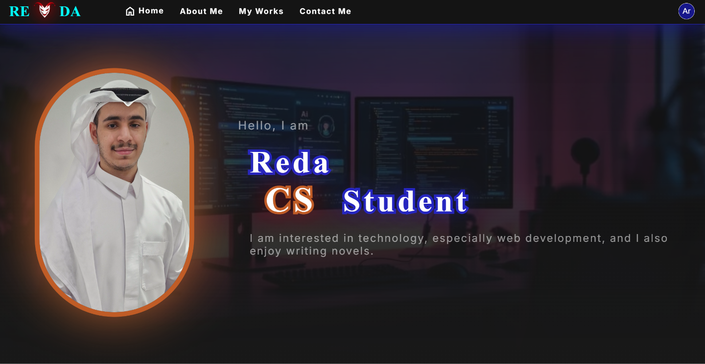

<div align="center">


# Reda Alqatifi — Personal Website

A bilingual (English / العربية) portfolio website showcasing my software projects, novels, and artwork.


</div>

---

## Table of Contents

- [Overview](#-overview)
- [Features](#-features)
- [Sections](#-sections)
- [Tech Stack](#-tech-stack)
- [Project Structure](#-project-structure)
- [Getting Started](#-getting-started)
- [Adding a Translation](#-adding-a-translation)

---

## Overview

This is my personal website. It brings together who I am, what I have built, and how to reach me.
It is written in plain **HTML, CSS, and JavaScript (ES Modules)**, with no frameworks and no build step.



---

## Features

- **Bilingual (EN / AR):** my own small i18n system that switches between English and Arabic, including **RTL layout**. The chosen language is saved in `localStorage`.
- **Infinite card carousel:** horizontal scrolling built on `requestAnimationFrame`, with auto-scroll and smooth manual control.
- **Scroll-reveal animations:** sections animate in as you scroll, using `IntersectionObserver`.
- **Accessibility:** follows the user's `prefers-reduced-motion` setting.
- **Works browser:** switch between Software, Novels, and Arts.
- **Popup viewer:** see artwork and details without leaving the page.
- **Modular code:** CSS is split per section and JavaScript per feature.

---

## Sections

| Section      | Description |
|--------------|-------------|
| **About Me** | General information about me: background, experience, and skills. |
| **My Works** | My work, split into three categories (below). |
| **Contact**  | Email, LinkedIn, and GitHub links. |

### My Works categories

- **Software:** each project belongs to one of these types:
  - **App:** Web · Mobile · Desktop · Cross-Platform
  - **Game:** Mobile · Desktop
  - **Terminal**
- **Novels:** my written stories.
- **Arts:** my illustrations and artwork.

---

## Tech Stack

| Layer     | Technology |
|-----------|------------|
| Markup    | HTML5 |
| Styling   | CSS3 (Flexbox, custom properties, media queries) |
| Scripting | Vanilla JavaScript (ES Modules) |
| Fonts     | Google Fonts: Inter, IBM Plex Sans Arabic, Material Symbols |

---

## 📁 Project Structure

```
My Personal Website/
├── assets/
│   ├── icons/              # Logo and social icons
│   └── images/             # Project logos, artwork, photos
│
├── src/
│   ├── html/
│   │   └── index.html      # Main page
│   │
│   ├── css/
│   │   ├── style.css       # Entry point (imports the files below)
│   │   ├── global.css      # Variables, resets, shared styles
│   │   ├── navbar.css
│   │   ├── intro.css
│   │   ├── aboutMe.css
│   │   ├── myWorks.css
│   │   ├── contact.css
│   │   └── footer.css
│   │
│   └── js/
│       ├── main.js             # Entry point, initializes all modules
│       ├── Animation.js        # Scroll-reveal animations
│       ├── cards_scrolling.js  # Infinite carousel
│       ├── div_as_anchor.js    # Clickable cards
│       ├── my_works.js         # Works category switching
│       ├── pop_up.js           # Popup viewer
│       └── i18n/
│           ├── i18n.js         # Language engine (EN/AR, RTL)
│           └── dictionary.js   # Translation strings
│
├── .gitignore
└── README.md
```

---

## Getting Started

### Prerequisites
- A modern web browser
- A local web server, because the site uses ES Modules, which browsers block over `file://`

### Run locally

```bash
# 1. Clone the repository
git clone https://github.com/Reda-Alqatifi/My-Personal-Website.git
cd My-Personal-Website

# 2. Start a local server (pick one)
npx serve .
# or
python -m http.server 8000
```

Then open `http://localhost:8000/src/html/index.html` (or the port your server shows).

> In VS Code, you can also use the **Live Server** extension: right-click `index.html` → *Open with Live Server*.

---

## Adding a Translation

1. Add a `data-i18n="section.key"` attribute to the element in `index.html`.
2. Add the key with its text to **both** `en` and `ar` in `src/js/i18n/dictionary.js`.
3. If a key is missing, the site falls back to English automatically.

---

<div align="center">

© 2026 Reda Alqatifi. All rights reserved.

</div>
